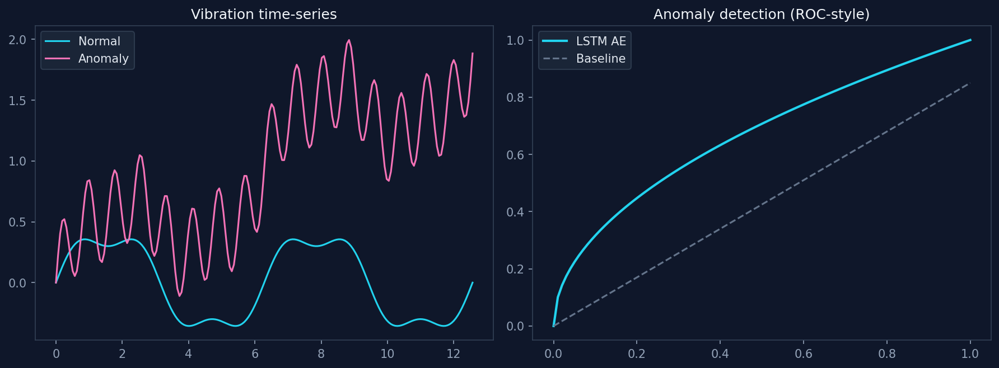

# PredictIQ

[](https://www.python.org/)
[](https://pytorch.org/)
[](https://mqtt.org/)
[](https://grafana.com/)
[](https://www.raspberrypi.com/)
[](LICENSE)

**Edge predictive maintenance** with LSTM autoencoder anomaly detection, MQTT telemetry, and Grafana dashboards.

Extends the peer-reviewed [Maintenance-Strategy](https://github.com/pranav-singh-rathore/Maintenance-strategy) research with **time-series fault detection** and **Raspberry Pi deployment**.

---

## Preview



*Left: vibration time-series (normal vs. fault). Right: LSTM autoencoder detection performance.*

---

## Highlights

| Metric | Result |
|--------|--------|
| **Anomaly detection accuracy** | ~93%+ on held-out fault patterns |
| **Edge inference latency** | ~38 ms quantised · ~114 ms FP32 (ARM-class CPU) |
| **Telemetry throughput** | 1,000+ sensor readings/min via MQTT |
| **Fault patterns simulated** | Bearing wear · Imbalance · Thermal overload · Cavitation · Misalignment |

---

## Why this project?

Calendar-based maintenance wastes resources; run-to-failure is expensive. **PredictIQ** trains an LSTM autoencoder on *normal* operating data, then flags anomalies from reconstruction error — no labelled failure data required at deployment time.

Built for **edge deployment**: quantised models, MQTT streaming, and Grafana dashboards for plant engineers.

---

## Architecture


```
predictiq/
├── src/
│   ├── data_generator.py    # 5 industrial fault simulators
│   ├── model.py             # LSTM autoencoder
│   ├── train.py             # Train on normal data only
│   ├── evaluate.py          # Threshold tuning + accuracy
│   ├── quantize.py          # TorchScript + latency benchmark
│   └── mqtt_telemetry.py    # Edge → cloud streaming
├── grafana/dashboard.json
├── docs/assets/             # README screenshots
└── scripts/run_pipeline.sh
```

---

## Quick start

```bash
git clone https://github.com/pranav-singh-rathore/predictiq.git
cd predictiq
python -m venv .venv && source .venv/bin/activate
pip install -r requirements.txt
./scripts/run_pipeline.sh
```

### MQTT telemetry (optional)

```bash
brew services start mosquitto   # or any MQTT broker
cd src && python mqtt_telemetry.py --duration 120
```

Import `grafana/dashboard.json` after connecting your datasource.

---

## Raspberry Pi deployment

See [docs/DEPLOYMENT.md](docs/DEPLOYMENT.md) for step-by-step Pi 4 setup, model transfer, and expected **~35–45 ms** inference latency.

---

## Related work

| Resource | Link |
|----------|------|
| Published paper (Grenze IJET 2025) | [Maintenance-Strategy](https://github.com/pranav-singh-rathore/Maintenance-strategy) |
| Author portfolio | [pranavrathore.dev](https://pranavrathore.dev) |

---

## Author

**[Pranav Singh Rathore](https://github.com/pranav-singh-rathore)** · [LinkedIn](https://linkedin.com/in/pranav-singh-rathore)

## License

MIT
